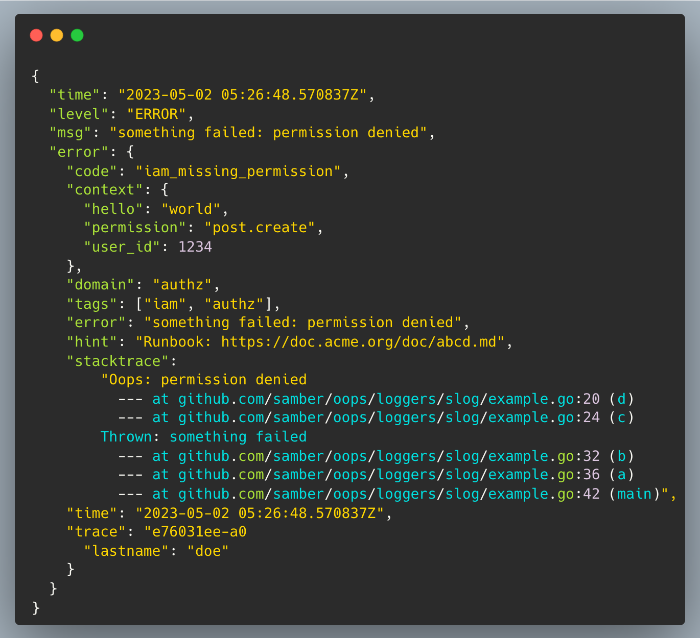
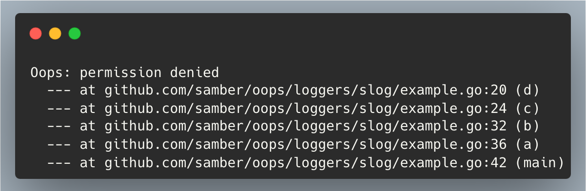
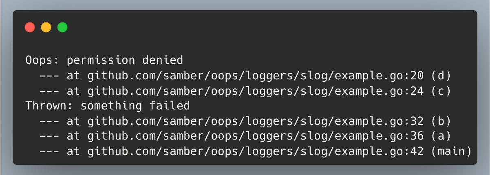
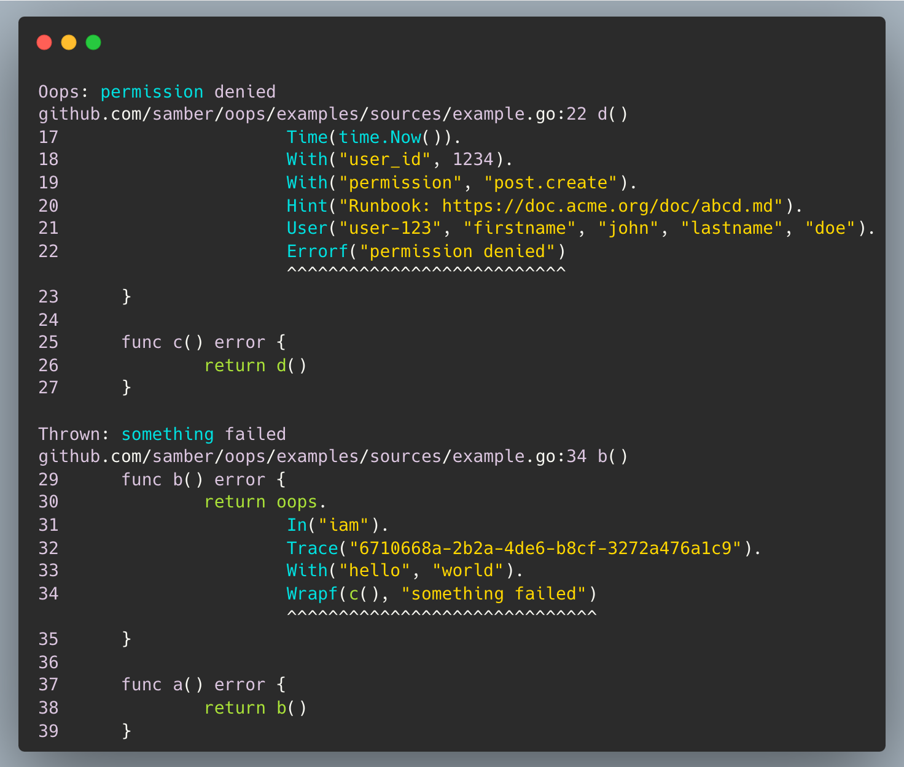
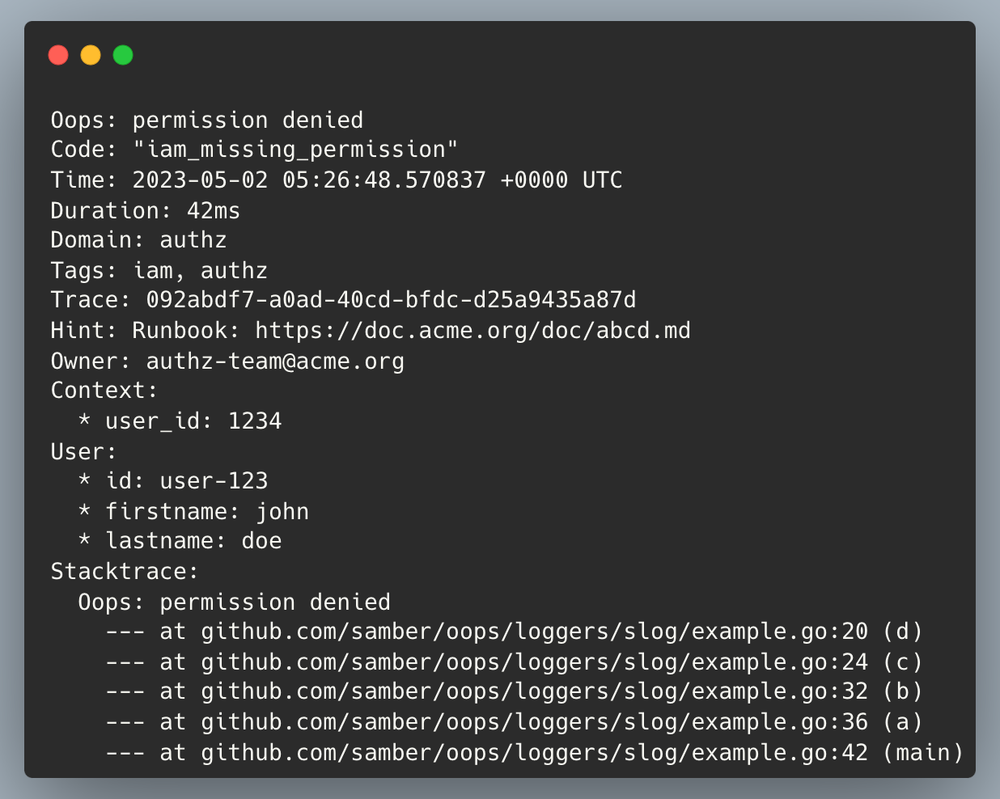
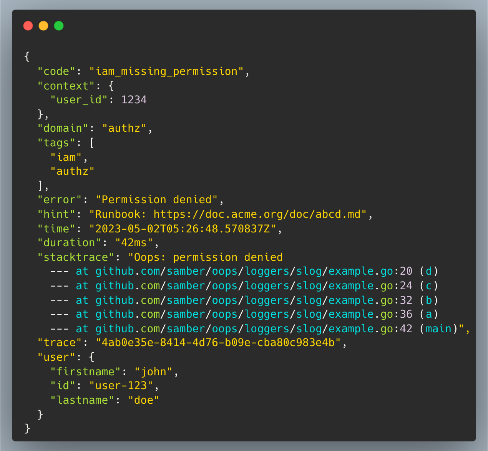

# Oops - Structured Error Handling for Go

> **Transform your Go error handling from "oops!" to "aha!" moments**

[](https://github.com/samber/oops/releases)

[](https://pkg.go.dev/github.com/samber/oops)

[](https://goreportcard.com/report/github.com/samber/oops)
[](https://codecov.io/gh/samber/oops)
[](https://github.com/samber/oops/graphs/contributors)
[](./LICENSE)

**Oops** is a comprehensive Go error handling library that provides structured error management with rich contextual information. It's designed as a drop-in replacement for Go's built-in `error`, adding powerful features like stack traces, source code fragments, structured attributes, and developer-friendly debugging hints.

**🎯 Key Features:**
- **🔧 Drop-in Replacement**: Seamlessly replaces standard Go error handling
- **📊 Rich Context**: Add structured attributes, user info
- **🐛 Debug-Friendly**: Out-of-the-box stacktraces and source code fragments
- **🔗 Error Chaining**: Wrap and compose errors with additional context
- **🛡️ Panic Recovery**: Built-in panic handling with error conversion
- **✅ Assertions**: One-line assertion helpers for validation
- **⚡ Performance**: Zero dependencies, lightweight and fast
- **📝 Logger Integration**: Works with all major Go logging libraries
- **✂️ Separation of Concerns**: Error handling and logging are separate jobs
- **🍳 Easy Integration**: No large refactoring required

> [!WARNING]  
> **Important**: This is NOT a logging library. `oops` should complements your existing logging toolchain (zap, zerolog, logrus, slog, go-sentry...).

🥷 Start hacking `oops` with this [playground](https://go.dev/play/p/ETUqN96Cj1G).

<div align="center">
  <hr>
  <sup><b>Sponsored by:</b></sup>
  <br>
  <a href="https://cast.ai/samuel">
    <div>
      
    </div>
    <div>
      Cut Kubernetes & AI costs, boost application stability
    </div>
  </a>
  <br>
  <a href="https://www.dash0.com?utm_campaign=148395251-samber%20github%20sponsorship&utm_source=github&utm_medium=sponsorship&utm_content=samber">
    <div>
      
    </div>
    <div>
      100% OpenTelemetry-native observability platform<br>Simple to use, built on open standards, and designed for full cost control
    </div>
  </a>
  <hr>
</div>


**Table of content**

- [🚀 Install](#-install)
- [💡 Quick start](#-quick-start)
- [🧠 Spec](#-spec)
  - [Error builder](#error-builder)
  - [Context](#context)
  - [Other helpers](#other-helpers)
  - [Stack trace](#stack-trace)
  - [Source fragments](#source-fragments)
  - [Panic handling](#panic-handling)
  - [Assertions](#assertions)
  - [Output](#output)
  - [Go context](#go-context)
- [📫 Loggers](#-loggers)
- [🥷 Tips and best practices](#-tips-and-best-practices)

### Context rich error handling

In a few minutes, your logs will look like this:

<div style="text-align:center;">
    
</div>

## 🚀 Install

```sh
go get github.com/samber/oops
```

This library is v1 and follows SemVer strictly.

No breaking changes will be made to APIs before v2.0.0.

This library has no dependencies outside the Go standard library.

## 💡 Quick start

This library provides a simple `error` builder for composing structured errors, with contextual attributes and stack trace.

Since `oops.OopsError` implements the `error` interface, you will be able to compose and wrap native errors with `oops.OopsError`.

```go
import "github.com/samber/oops"

func main() {
    // Simple error with context
    err := oops.
        In("user-service").
        Tags("database", "postgres").
        Code("network_failure").
        User("user-123", "email", "foo@bar.com").
        With("path", "/hello/world").
        Errorf("failed to fetch user: %s", "connection timeout")
    
    // Error wrapping
    if err != nil {
        return oops.
            Trace("req-123").
            With("product_id", "456").
            Wrapf(err, "user operation failed")
    }
}
```

## 🧠 Spec

GoDoc: [https://godoc.org/github.com/samber/oops](https://godoc.org/github.com/samber/oops)

### Error builder

| Method                                                                  | Description                                                                                           |
| ----------------------------------------------------------------------- | ----------------------------------------------------------------------------------------------------- |
| `.New(message string) error`                                            | Formats returns `oops.OopsError` object that satisfies `error`                                        |
| `.Errorf(format string, args ...any) error`                             | Formats an error and returns `oops.OopsError` object that satisfies `error`                           |
| `.Wrap(err error) error`                                                | Wraps an error into an `oops.OopsError` object that satisfies `error`                                 |
| `.Wrapf(err error, format string, args ...any) error`                   | Wraps an error into an `oops.OopsError` object that satisfies `error` and formats an error message    |
| `.Recover(cb func()) error`                                             | Handle panic and returns `oops.OopsError` object that satisfies `error`.                              |
| `.Recoverf(cb func(), format string, args ...any) error`                | Handle panic and returns `oops.OopsError` object that satisfies `error` and formats an error message. |
| `.Assert(condition bool) OopsErrorBuilder`                              | Panics if condition is false. Assertions can be chained.                                              |
| `.Assertf(condition bool, format string, args ...any) OopsErrorBuilder` | Panics if condition is false and formats an error message. Assertions can be chained.                 |
| `.Join(err1 error, err2 error, ...) error`                              | Join returns an error that wraps the given errors.                                                    |

#### Examples

```go
// with error wrapping
err0 := oops.
    In("repository").
    Tags("database", "sql").
    Wrapf(sql.Exec(query), "could not fetch user")  // Wrapf returns nil when sql.Exec() is nil

// with panic recovery
err1 := oops.
    In("repository").
    Tags("database", "sql").
    Recover(func () {
        panic("caramba!")
    })

// with assertion
err2 := oops.
    In("repository").
    Tags("database", "sql").
    Recover(func () {
        // ...
        oops.Assertf(time.Now().Weekday() == 1, "This code should run on Monday only.")
        // ...
    })

// oops.New
err3 := oops.
    In("repository").
    Tags("database", "sql").
    New("an error message")

// oops.Errorf
err4 := oops.
    In("repository").
    Tags("database", "sql").
    Errorf("an error message: %d", 42)
```

### Context

The library provides an error builder. Each method can be used standalone (eg: `oops.With(...)`) or from a previous builder instance (eg: `oops.In("iam").User("user-42")`).

The `oops.OopsError` builder must finish with either `.Errorf(...)`, `.Wrap(...)`, `.Wrapf(...)`, `.Join(...)`, `.Recover(...)` or `.Recoverf(...)`.

| Builder method                          | Getter                                  | Description                                                                                                                                                                                |
| --------------------------------------- | --------------------------------------- | ------------------------------------------------------------------------------------------------------------------------------------------------------------------------------------------ |
| `.With(string, any)`                    | `err.Context() map[string]any`          | Supply a list of attributes key+value. Values of type `func() any {}` are accepted and evaluated lazily.                                                                                   |
| `.WithContext(context.Context, ...any)` | `err.Context() map[string]any`          | Supply a list of values declared in context. Values of type `func() any {}` are accepted and evaluated lazily.                                                                             |
| `.Code(any)`                            | `err.Code() any`                        | Set a code or slug that describes the error. Error messages are intended to be read by humans, but such code is expected to be read by machines and be transported over different services |
| `.Public(string)`                       | `err.Public() string`                   | Set a message that is safe to show to an end user                                                                                                                                          |
| `.Time(time.Time)`                      | `err.Time() time.Time`                  | Set the error time (default: `time.Now()`)                                                                                                                                                 |
| `.Since(time.Time)`                     | `err.Duration() time.Duration`          | Set the error duration                                                                                                                                                                     |
| `.Duration(time.Duration)`              | `err.Duration() time.Duration`          | Set the error duration                                                                                                                                                                     |
| `.In(string)`                           | `err.Domain() string`                   | Set the feature category or domain                                                                                                                                                         |
| `.Tags(...string)`                      | `err.Tags() []string`                   | Add multiple tags, describing the feature returning an error                                                                                                                               |
|                                         | `err.HasTag(string) bool`               | Check whether the error contains provided tag                                                                                                                                              |
| `.Trace(string)`                        | `err.Trace() string`                    | Add a transaction id, trace id, correlation id... (default: ULID)                                                                                                                          |
| `.Span(string)`                         | `err.Span() string`                     | Add a span representing a unit of work or operation... (default: ULID)                                                                                                                     |
| `.Hint(string)`                         | `err.Hint() string`                     | Set a hint for faster debugging                                                                                                                                                            |
| `.Owner(string)`                        | `err.Owner() (string)`                  | Set the name/email of the colleague/team responsible for handling this error. Useful for alerting purpose                                                                                  |
| `.User(string, any...)`                 | `err.User() (string, map[string]any)`   | Supply user id and a chain of key/value                                                                                                                                                    |
| `.Tenant(string, any...)`               | `err.Tenant() (string, map[string]any)` | Supply tenant id and a chain of key/value                                                                                                                                                  |
| `.Request(*http.Request, bool)`         | `err.Request() *http.Request`           | Supply http request                                                                                                                                                                        |
| `.Response(*http.Response, bool)`       | `err.Response() *http.Response`         | Supply http response                                                                                                                                                                       |
| `.FromContext(context.Context)`         |                                         | Reuse an existing OopsErrorBuilder transported in a Go context                                                                                                                             |

#### Examples

```go
// simple error with public facing message
err0 := oops.
    Public("Could not fetch user.").
    Errorf("sql: bad connection")

// simple error with stacktrace
err1 := oops.New("could not fetch user")

// with optional domain
err2 := oops.
    In("repository").
    Tags("database", "sql").
    Errorf("could not fetch user")

// with custom attributes
ctx := context.WithContext(context.Background(), "a key", "value")
err3 := oops.
    With("driver", "postgresql").
    With("query", query).
    With("query.duration", queryDuration).
    With("lorem", func() string { return "ipsum" }).	// lazy evaluation
    WithContext(ctx, "a key", "another key").
    Errorf("could not fetch user")

// with trace+span
err4 := oops.
    Trace(traceID).
    Span(spanID).
    Errorf("could not fetch user")

// with hint and ownership, for helping developer to solve the issue
err5 := oops.
    Hint("The user could have been removed. Please check deleted_at column.").
    Owner("Slack: #api-gateway").
    Errorf("could not fetch user")

// with optional userID
err6 := oops.
    User(userID).
    Errorf("could not fetch user")

// with optional user data
err7 := oops.
    User(userID, "firstname", "Samuel").
    Errorf("could not fetch user")

// with optional user and tenant
err8 := oops.
    User(userID, "firstname", "Samuel").
    Tenant(workspaceID, "name", "my little project").
    Errorf("could not fetch user")

// with optional http request and response
err9 := oops.
    Request(req, false).
    Response(res, true).
    Errorf("could not fetch user")

// reuse an existing OopsErrorBuilder transported in a Go context
ctx := oops.WithBuilder(context.TODO(), err9)
// [...]
err10 := oops.
    FromContext(ctx).
    Errorf("could not fetch user")
```

### Other helpers

- `oops.AsError[MyError](error) (MyError, bool)` as an alias to `errors.As(...)`

### Stack trace

This library provides a pretty printed stack trace for each generated error.

The stack trace max depth can be set using:

```go
// default: 10
oops.StackTraceMaxDepth = 42
```

The stack trace will be printed this way:

```go
err := oops.Errorf("permission denied")

fmt.Println(err.(oops.OopsError).Stacktrace())
```

<div style="text-align:center;">
    
</div>

Wrapped errors will be reported as an annotated stack trace:

```go
err1 := oops.Errorf("permission denied")
// ...
err2 := oops.Wrapf(err1, "something failed")

fmt.Println(err2.(oops.OopsError).Stacktrace())
```

<div style="text-align:center;">
    
</div>

### Source fragments

The exact error location can be provided in a Go file extract.

Source fragments are hidden by default. You must run `oops.SourceFragmentsHidden = false` to enable this feature. Go source files being read at run time, you have to keep the source code at the same location.

In a future release, this library is expected to output a colorized extract. Please contribute!

```go
oops.SourceFragmentsHidden = false

err1 := oops.Errorf("permission denied")
// ...
err2 := oops.Wrapf(err, "something failed")

fmt.Println(err2.(oops.OopsError).Sources())
```

<div style="text-align:center;">
    
</div>

### Panic handling

`oops` library is delivered with a try/catch -ish error handler. 2 handlers variants are available: `oops.Recover()` and `oops.Recoverf()`. Both can be used in the `oops` error builder with usual methods.

🥷 Start hacking `oops.Recover()` with this [playground](https://go.dev/play/p/uGwrFj9mII8).

```go
func mayPanic() {
	panic("permission denied")
}

func handlePanic() error {
    return oops.
        Code("iam_authz_missing_permission").
        In("authz").
        With("permission", "post.create").
        Trace("6710668a-2b2a-4de6-b8cf-3272a476a1c9").
        Hint("Runbook: https://doc.acme.org/doc/abcd.md").
        Recoverf(func() {
            // ...
            mayPanic()
            // ...
        }, "unexpected error %d", 42)
}
```

### Assertions

Assertions may be considered an anti-pattern for Golang since we only call `panic()` for unexpected and critical errors. In this situation, assertions might help developers to write safer code.

```go
func mayPanic() {
    x := 42

    oops.
        Trace("6710668a-2b2a-4de6-b8cf-3272a476a1c9").
        Hint("Runbook: https://doc.acme.org/doc/abcd.md").
        Assertf(time.Now().Weekday() == 1, "This code should run on Monday only.").
        With("x", x).
        Assertf(x == 42, "expected x to be equal to 42, but got %d", x)

    oops.Assert(re.Match(email))

    // ...
}

func handlePanic() error {
    return oops.
        Code("iam_authz_missing_permission").
        In("authz").
        Recover(func() {
            // ...
            mayPanic()
            // ...
        })
}
```

### Output

Errors can be printed in many ways. Logger formatters provided in this library use these methods.

#### Errorf `%w`

```go
str := fmt.Errorf("something failed: %w", oops.Errorf("permission denied"))

fmt.Println(err.Error())
// Output:
// something failed: permission denied
```

#### printf `%v`

```go
err := oops.Errorf("permission denied")

fmt.Printf("%v", err)
// Output:
// permission denied
```

#### printf `%+v`

```go
err := oops.Errorf("permission denied")

fmt.Printf("%+v", err)
```

<div style="text-align:center;">
    
</div>

#### JSON Marshal

```go
b := json.MarshalIndent(err, "", "  ")
```

<div style="text-align:center;">
    
</div>

#### slog.Valuer

```go
err := oops.Errorf("permission denied")

attr := slog.Error(err.Error(),
    slog.Any("error", err))

// Output:
// slog.Group("error", ...)
```

#### Custom timezone

```go
loc, _ := time.LoadLocation("Europe/Paris")
oops.Local = loc
```

### Go context

An `OopsErrorBuilder` can be transported in a go `context.Context` to reuse later.

```go
func myFunc(ctx context.Context) {
    oops.
        FromContext(ctx).
        Tag("auth").
        Errorf("not permitted")
}

func main() {
    err := oops.
        In("my domain").
        User("user-123")
    ctx := oops.WithBuilder(context.TODO(), err)

    myFunc(ctx)
}
```

## 📫 Loggers

Some loggers may need a custom formatter to extract attributes from `oops.OopsError`.

Available loggers:
- log: [playground](https://go.dev/play/p/uNx3CcT-X40) - [example](https://github.com/samber/oops/tree/master/examples/log)
- slog: [playground](https://go.dev/play/p/-X2ZnqjyDLu) - [example](https://github.com/samber/oops/tree/master/examples/slog)
- zap: [formatter](https://github.com/samber/oops/tree/master/loggers/zap) - [example](https://github.com/samber/oops/tree/master/examples/zap)
- logrus: [formatter](https://github.com/samber/oops/tree/master/loggers/logrus) - [playground](https://go.dev/play/p/-_7EBnceJ_A) - [example](https://github.com/samber/oops/tree/master/examples/logrus)
- zerolog: [formatter](https://github.com/samber/oops/tree/master/loggers/zerolog) - [playground](https://go.dev/play/p/aalqQ6wEDyx) - [example](https://github.com/samber/oops/tree/master/examples/zerolog)

We are looking for contributions and examples for:
- go-sentry
- otel
- other?

Examples of formatters can be found in `ToMap()`, `Format()`, `Marshal()` and `LogValuer` methods of `oops.OopsError`.

## 🥷 Tips and best practices

### Public facing error message

Humans do not like technical errors. The `oops` container can bring an additional human-readable message.

```go
err := oops.
    Public("Could not fetch user.").
    Errorf("sql: bad connection")

userMessage := oops.GetPublic(err, "Unexpected error")
```

### Wrap/Wrapf shortcut

`oops.Wrap(...)` and `oops.Wrapf(...)` returns nil if the provided `error` is nil.

❌ So don't write:

```go
err := mayFail()
if err != nil {
    return oops.Wrapf(err, ...)
}

return nil
```

✅ but write:

```go
return oops.Wrapf(mayFail(), ...)
```

### Reuse error builder

Writing a full contextualized error can be painful and very repetitive. But a single context can be used for multiple errors in a single function:

❌ So don't write:

```go
err := mayFail1()
if err != nil {
    return oops.
        In("iam").
        Trace("77cb6664").
        With("hello", "world").
        Wrap(err)
}

err = mayFail2()
if err != nil {
    return oops.
        In("iam").
        Trace("77cb6664").
        With("hello", "world").
        Wrap(err)
}

return oops.
    In("iam").
    Trace("77cb6664").
    With("hello", "world").
    Wrap(mayFail3())
```

✅ but write:

```go
errorBuilder := oops.
    In("iam").
    Trace("77cb6664").
    With("hello", "world")

err := mayFail1()
if err != nil {
    return errorBuilder.Wrap(err)
}

err = mayFail2()
if err != nil {
    return errorBuilder.Wrap(err)
}

return errorBuilder.Wrap(mayFail3())
```

### Caller/callee attributes

Also, think about feeding error context in every caller, instead of adding extra information at the last moment.

❌ So don't write:

```go
func a() error {
    return b()
}

func b() error {
    return c()
}

func c() error {
    return d()
}

func d() error {
    return oops.
        Code("iam_missing_permission").
        In("authz").
        Trace("4ea76885-a371-46b0-8ce0-b72b277fa9af").
        Time(time.Now()).
        With("hello", "world").
        With("permission", "post.create").
        Hint("Runbook: https://doc.acme.org/doc/abcd.md").
        User("user-123", "firstname", "john", "lastname", "doe").
        Tenant("organization-123", "name", "Microsoft").
        Errorf("permission denied")
}
```

✅ but write:

```go
func a() error {
	return b()
}

func b() error {
    return oops.
        In("iam").
        Trace("4ea76885-a371-46b0-8ce0-b72b277fa9af").
        With("hello", "world").
        Wrapf(c(), "something failed")
}

func c() error {
    return d()
}

func d() error {
    return oops.
        Code("iam_missing_permission").
        In("authz").
        Time(time.Now()).
        With("permission", "post.create").
        Hint("Runbook: https://doc.acme.org/doc/abcd.md").
        User("user-123", "firstname", "john", "lastname", "doe").
        Tenant("organization-123", "name", "Microsoft").
        Errorf("permission denied")
}
```

## Why naming this library "oops"?

Have you already heard a developer yelling at unclear error messages in Sentry, with zero context, only to realize he wrote that piece of shit himself?

Yes. Me too.

<div style="text-align:center;">
    
</div>

## 🤝 Contributing

- Ping me on Twitter [@samuelberthe](https://twitter.com/samuelberthe) (DMs, mentions, whatever :))
- Fork the [project](https://github.com/samber/oops)
- Fix [open issues](https://github.com/samber/oops/issues) or request new features

Don't hesitate ;)

```bash
# Install some dev dependencies
make tools

# Run tests
make test
# or
make watch-test
```

## 👤 Contributors


## 💫 Show your support

Give a ⭐️ if this project helped you!

[](https://github.com/sponsors/samber)

## 📝 License

Copyright © 2023 [Samuel Berthe](https://github.com/samber).

This project is [MIT](./LICENSE) licensed.
